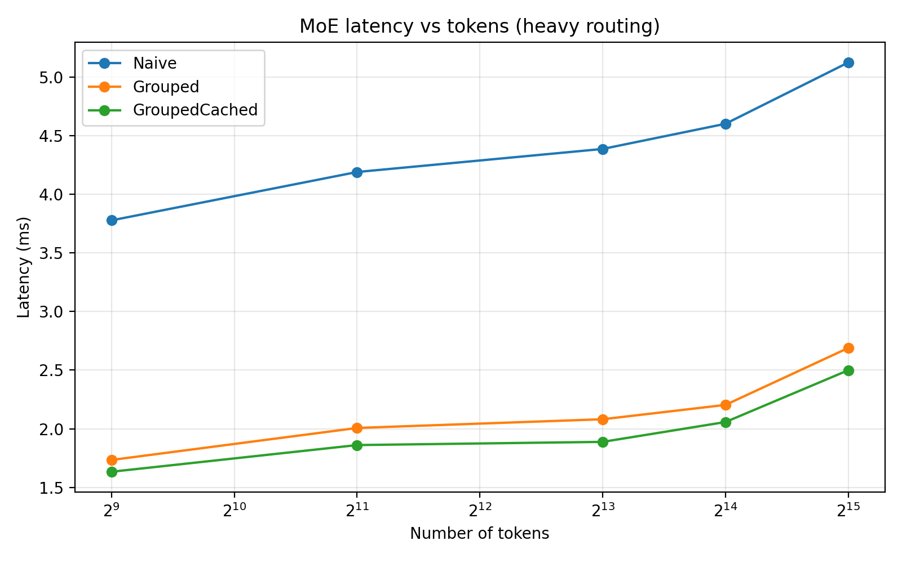
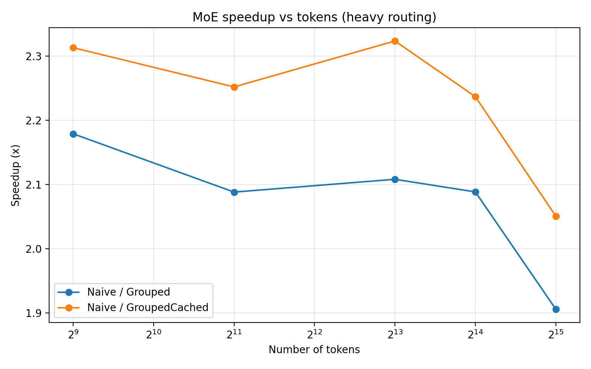
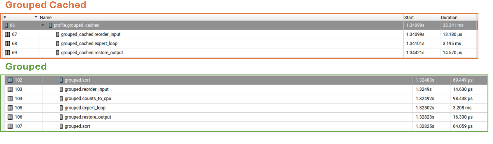

# Toy MoE Inference Routing Benchmark on GPU

A small GPU microbenchmark that studies **routing and dispatch overhead** in a toy Mixture-of-Experts (MoE) inference layer.

The goal of this project is not to build a full transformer or production MoE serving stack. The goal is to isolate one systems question:

> When token routing is irregular in an MoE layer, how much overhead comes from routing and dispatch, and does grouping token states by expert improve throughput?

This project implements three execution strategies for a toy MoE layer, benchmarks them on GPU, and profiles them with Nsight Systems.

---

## Why this project exists

Modern MoE inference workloads combine two things that are often awkward for GPU execution:

- **expert specialization**, which causes tokens to be routed to different experts
- **irregular routing patterns**, which can create indexing, gather/scatter, and scheduling overhead

This benchmark isolates that routing/dispatch problem in a minimal setting.

Rather than building a full transformer, this project focuses on a single MoE layer with synthetic routing so that the performance story stays clear and measurable.

---

## What is implemented

The benchmark uses a toy MoE layer with:

- input tensor of shape `[num_tokens, hidden_dim]`
- one expert assignment per token
- `num_experts` independent experts
- each expert implemented as a small FFN:
  - `Linear(hidden_dim, ffn_dim)`
  - `GELU`
  - `Linear(ffn_dim, hidden_dim)`

The current benchmark configuration uses:

- `hidden_dim = 256`
- `ffn_dim = 512`
- `num_experts = 64`
- `num_tokens in {512, 2048, 8192, 16384, 32768}`
- routing regimes: `uniform` and `heavy` 

The benchmark writes results to `results/benchmark_results.csv` with latency and speedup columns for all three implementations.

---

## Routing regimes

Routing is synthetic and controllable rather than learned.

The benchmark generates expert assignments directly using configurable routing distributions:

- **uniform**: approximately balanced token counts across experts
- **heavy**: one expert receives a disproportionately large share of tokens

This keeps the benchmark focused on routing/dispatch behavior instead of model quality or router training. The same helper is used in both benchmarking and profiling. 

---

## Implementations

### 1. NaiveMoE

For each expert:

1. find all token indices assigned to that expert
2. gather those token rows from the input
3. run that expert FFN
4. scatter the outputs back to their original token positions

This repeats for every expert, so the implementation performs repeated per-expert indexed gather/scatter work. 

### 2. GroupedMoE

This version groups token states by expert **online** each forward pass:

1. sort expert assignments
2. reorder the input so tokens for the same expert are contiguous
3. count how many tokens belong to each expert
4. run each expert on a contiguous slice
5. restore outputs to original token order

Compared with the naive baseline, this reduces repeated per-expert indexed gathering by turning routing into one global reorder followed by contiguous expert slices. However, it still pays the online cost of:

- sorting the assignments
- counting tokens per expert
- restoring original output order

every forward pass. 

### 3. GroupedMoECached

This version precomputes routing metadata once for a **fixed expert-assignment pattern**:

- `sort_order`
- `restore_order`
- per-expert offsets

Each forward still reorders the input and restores the output, but it avoids rebuilding the routing plan online. This isolates the cost of online plan construction from the cost of the expert FFNs themselves.

---

## Benchmark methodology

For each routing regime and token count, the benchmark:

1. creates random token states on GPU
2. generates synthetic expert assignments
3. instantiates `NaiveMoE`, `GroupedMoE`, and `GroupedMoECached`
4. copies weights so all implementations are mathematically identical
5. verifies numerical correctness with `torch.allclose(...)`
6. times each implementation using CUDA events
7. writes the results to CSV

The benchmark uses warmup runs and `torch.inference_mode()` to reduce measurement noise and avoid autograd overhead.

---

## Main result

The grouped execution strategies are consistently faster than the naive baseline in this toy MoE benchmark, and the cached-grouped version is consistently the fastest of the three.

The high-level interpretation is:

- **NaiveMoE** pays repeated routing and dispatch overhead for each expert
- **GroupedMoE** improves throughput by reorganizing tokens into expert-contiguous batches (Uniform: 2.10 X - 2.25 X | Heavy 1.90 X - 2.21 X )
- **GroupedMoECached** removes the additional online cost of rebuilding the grouping plan each forward (Uniform: 2.22 X - 2.76 X | Heavy 2.04 X - 2.35 X )

In this benchmark, the biggest gain comes from **grouping the tokens by expert at all**. Precomputing the grouping metadata gives a smaller but still measurable additional improvement.

---

## Figures

### Latency under heavy routing



### Speedup under heavy routing



---

## Nsight Systems profiling

Nsight Systems was used to understand **why** `GroupedMoECached` is faster than `GroupedMoE`.

The profiling setup uses NVTX ranges around the relevant execution regions, including:

- `naive.expert_loop`
- `grouped.sort`
- `grouped.counts_to_cpu`
- `grouped.expert_loop`
- `grouped.restore_output`
- `grouped_cached.reorder_input`
- `grouped_cached.expert_loop`
- `grouped_cached.restore_output` 

### Profiling takeaway

Profiling showed that both grouped variants are still dominated by the expert FFN loop, but the online grouped implementation also pays extra per-forward overhead for:

- sorting expert assignments
- computing token counts / grouping metadata online

The cached-grouped implementation removes those online plan-construction stages from the hot path, which explains why it is consistently faster than the online grouped version.

### Nsight Systems: Grouped vs. GroupedCached
The Nsight screenshot below uses one representative profiling configuration to isolate the difference between online grouping and cached grouping.



> Nsight Systems showed that the online grouped path still paid per-forward sorting and routing-plan construction overhead, while the cached-grouped path removed those stages from the hot path and spent more of its time directly in reorder + expert execution + restore.

---

## Limitations and Notes


Important limitations:

- this is **one toy MoE layer**, not a full transformer
- routing is **synthetic**, not produced by a learned router
- the implementation uses **eager PyTorch**, not fused grouped GEMM kernels
- the cached-grouped setup assumes a **fixed routing pattern** across forwards, which is often not true in real MoE inference

Because of that, `GroupedMoECached` should be interpreted mainly as:

- an **ablation** that isolates the cost of online routing-plan construction, or
- an **optimistic upper bound** for cases where routing metadata can be reused


A second important observation is that the benefit of grouped dispatch shrinks as expert FFN compute becomes more dominant. In larger-compute regimes, all implementations spend more of their time in the expert FFNs themselves, so the relative benefit of improved routing organization decreases. However, we did not test this explicitly, the results assume fixed size FFN and token states. S
---

## What this project demonstrates

This project demonstrates:

- building a GPU microbenchmark around an inference-shaped workload
- isolating routing/dispatch overhead from expert compute
- comparing multiple execution organizations for identical math
- using CUDA timing and Nsight Systems to explain performance differences

This is best interpreted as a **systems-oriented inference benchmark**, not as a model-quality or production-serving project.

## Repo layout

```text
moe-bench/
├── README.md
├── moe.py
├── bench.py
├── profile.py
├── plot_bench.py
├── results/
└── figures/